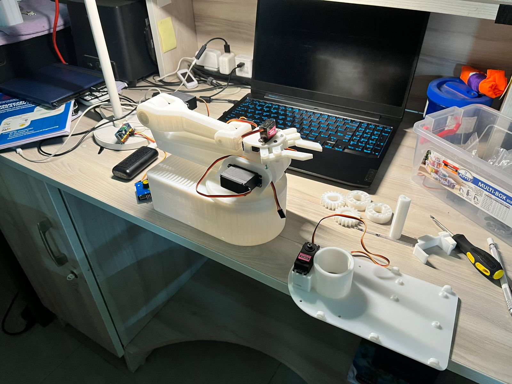

# 6-DOF Robotic Arm with Python Control

This project details the construction and control of a 3D-printed, 6-degree-of-freedom (DOF) robotic arm. The arm is controlled in real-time using a Python script, which communicates with an Arduino via the `pyfirmata` library.

The control script allows for direct keyboard mapping to each servo, as well as a "Record & Playback" feature to save and repeat movements.
Note : Since the base of the arm is lightweight, it tends to tip over at full extension (happens in the video demo). I recommend adding some sort of ballast (e.g., Powerbank) to give it stability.

Note: This is an ongoing project, I have planned to incoporate Gemini's Robot Vision model to this arm.

---

## Visuals

**Assembling the Arm**


**Short working demo**
![Working Demo]
Link to video: https://drive.google.com/file/d/1_vWtYNRWYJmLAz50ZfHUF_piOmAfnYBo/view?usp=sharing 

``

## Features

* **Real-time Keyboard Control:** Each joint is mapped to keyboard keys for intuitive movement.
* **Record & Playback:** Record a sequence of movements and play it back with a single key.
* **Return to Home:** A simple "home" function to return the arm to its neutral starting position.
* **Python-Based:** No complex Arduino code needed; the Arduino simply runs `StandardFirmataPlus` to act as a bridge.

---

## 1. Hardware Requirements

* **3D Printed Arm:** Parts from [this MakerWorld model by Lylio](https://makerworld.com/en/models/1134925-robotic-arm-with-servo-arduino#profileId-1135927).
* **Arduino:** An Arduino Uno, Nano, or any compatible board.
* **Servos:** 7 x servo motors (e.g., MG90S or SG90). The number and type depend on your arm build.
* **Power Supply:** An external 5V power supply for the servos (recommended, as USB power is often insufficient).
* **Wires:** Jumper wires.

## 2. Software Requirements

* **Python 3:** [Download from python.org](https://www.python.org/)
* **Python Libraries:** `pyfirmata`
* **Arduino IDE:** [Download from arduino.cc](https://www.arduino.cc/en/software)

---

## 3. Step-by-Step Setup

### Step 1: Hardware Assembly & Wiring

1.  **Print & Build:** Print all the parts from the [MakerWorld project page](https://makerworld.com/en/models/1134925-robotic-arm-with-servo-arduino#profileId-1135927) and assemble the arm with your servos.
2.  **Connect Servos to Arduino:** Connect the signal, 5V, and GND wires for each servo.
    * **WARNING:** It is highly recommended to power the servos from an **external 5V power supply**. Do not draw power for 7 servos directly from the Arduino's 5V pin, as this can damage the Arduino or your computer's USB port. Connect all servo grounds (GND) and the Arduino's GND together.
3.  **Wiring Map:** Connect the **signal pins** of your servos to the Arduino pins defined in the script:

| Servo Function | Arduino Pin |
| :--- | :--- |
| Base 1 | Pin 10 (PWM) |
| Base 2 | Pin 9 (PWM) |
| Shoulder | Pin 11 (PWM) |
| Elbow | Pin 6 (PWM) |
| Arm Bend | Pin 5 (PWM) |
| Gripper Rotate | Pin 3 (PWM) |
| Gripper Grasp | Pin 4 |

### Step 2: Upload Firmata to Arduino

The Python script works by sending commands *to* the Arduino. The Arduino must be running a "listener" sketch called `StandardFirmataPlus`.

1.  Open the **Arduino IDE**.
2.  Go to **File > Examples > Firmata > StandardFirmataPlus**.
3.  Select your Arduino board and port from the **Tools** menu.
4.  Click **Upload**.

Once this is done, you don't need to write any Arduino code. You can close the Arduino IDE.

### Step 3: Set Up the Python Environment

1.  **Clone this Repository:**
    ```bash
    git clone [https://github.com/YOUR_USERNAME/YOUR_REPOSITORY_NAME.git](https://github.com/YOUR_USERNAME/YOUR_REPOSITORY_NAME.git)
    cd YOUR_REPOSITORY_NAME
    ```
2.  **(Recommended) Create a Virtual Environment:**
    ```bash
    python -m venv venv
    source venv/bin/activate  # On Windows: venv\Scripts\activate
    ```
3.  **Install Required Libraries:**
    ```bash
    pip install -r requirements.txt
    ```
4.  **Configure the Script:**
    * Open `keyboard_arm_control.py` in a text editor.
    * Find the line: `PORT = 'COM7'`
    * Change `'COM7'` to match the port your Arduino is connected to (e.g., `'COM3'` on Windows, or `'/dev/ttyUSB0'` on Linux).

---

## 4. How to Use

Run the main Python script from your terminal:

```bash
python keyboard_arm_control.py
```

Once connected, use the following keys:

### Movement
* **Base:** `Left Arrow` / `Right Arrow`
* **Shoulder:** `Up Arrow` / `Down Arrow`
* **Elbow:** `w` / `s`
* **Arm Bend:** `t` / `y`
* **Gripper Rotate:** `a` / `d`
* **Gripper Grasp:** `1` (Close) / `2` (Open)

### System
* **Start Record:** `r`
* **Stop Record:** `o`
* **Playback Path:** `p`
* **Return to Home:** `h`
* **Show Help:** `?`
* **Exit Program:** `Esc`

### Important Note for Windows Users
This script uses the `msvcrt` library for non-blocking keyboard input, which is specific to Windows. For Linux or macOS, this part of the code would need to be replaced (e.g., using the `pynput` library).

## Credits
* **3D Arm Model:** [[Lylio on MakerWorld](https://makerworld.com/en/models/1134925-robotic-arm-with-servo-arduino#profileId-1135927)](https://makerworld.com/en/models/1134925-robotic-arm-with-servo-arduino#profileId-1135927)
* **Control Code:** Naveen Kumar
